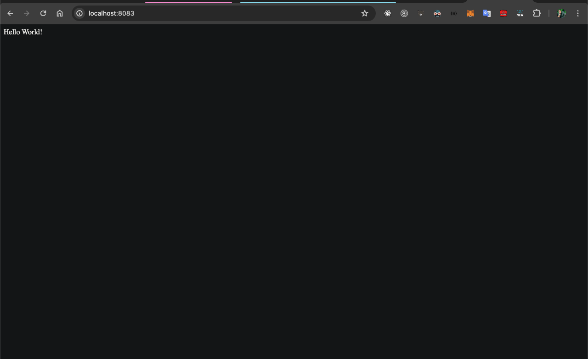

## Build
docker build -t andersonlimadev/app-node:1.0 .

this command will run the Dockerfile

## see images
docker images

## Run the image
andersonlimadev/app-node:1.0

## Run
docker run -d -p 8083:3000 andersonlimadev/app-node:1.0

open the link in your browser
[app-node: http://localhost:8083/](http://localhost:8083/)

